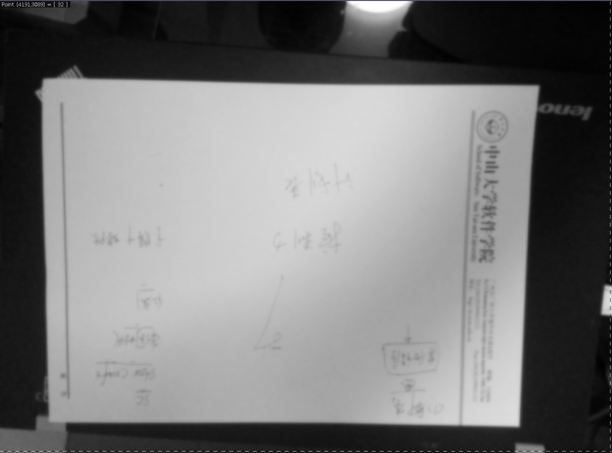
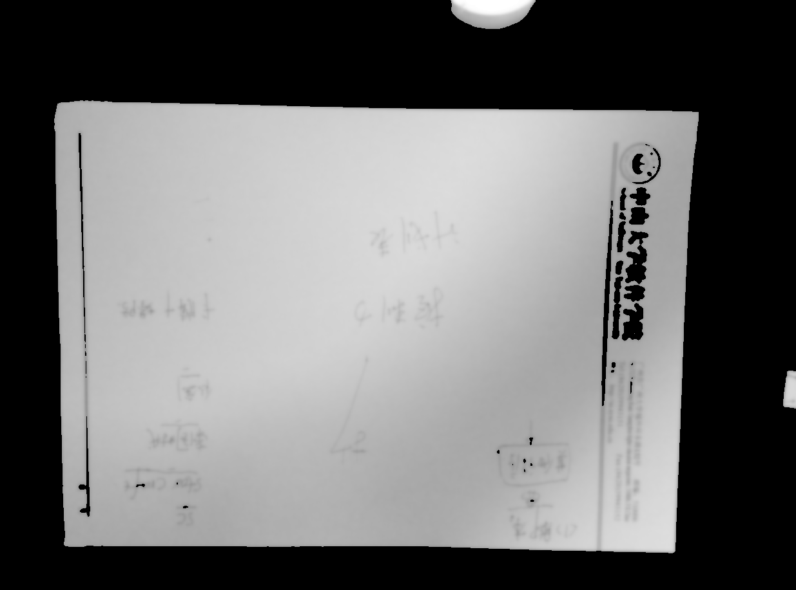
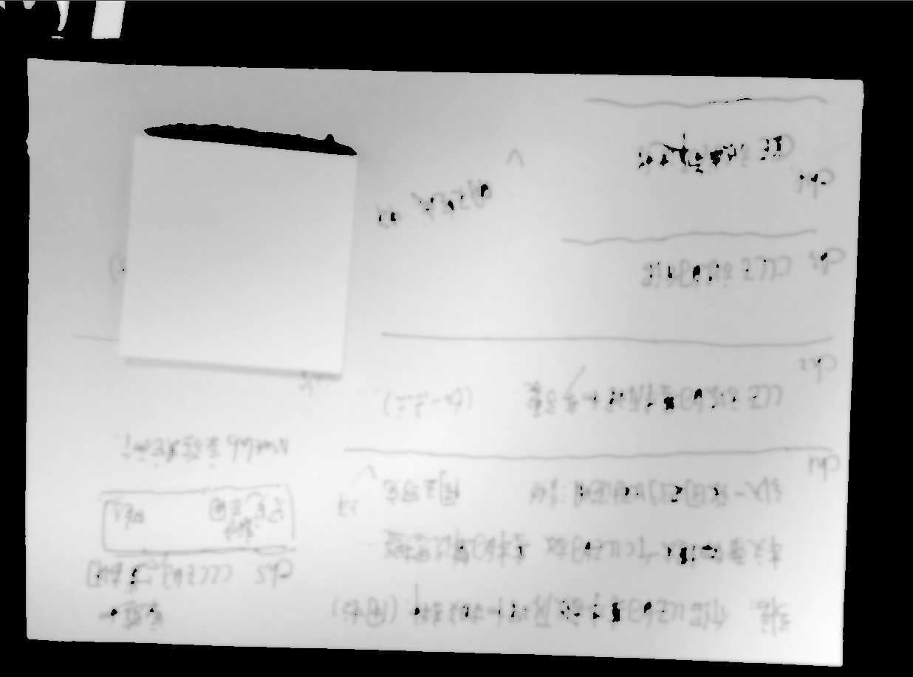
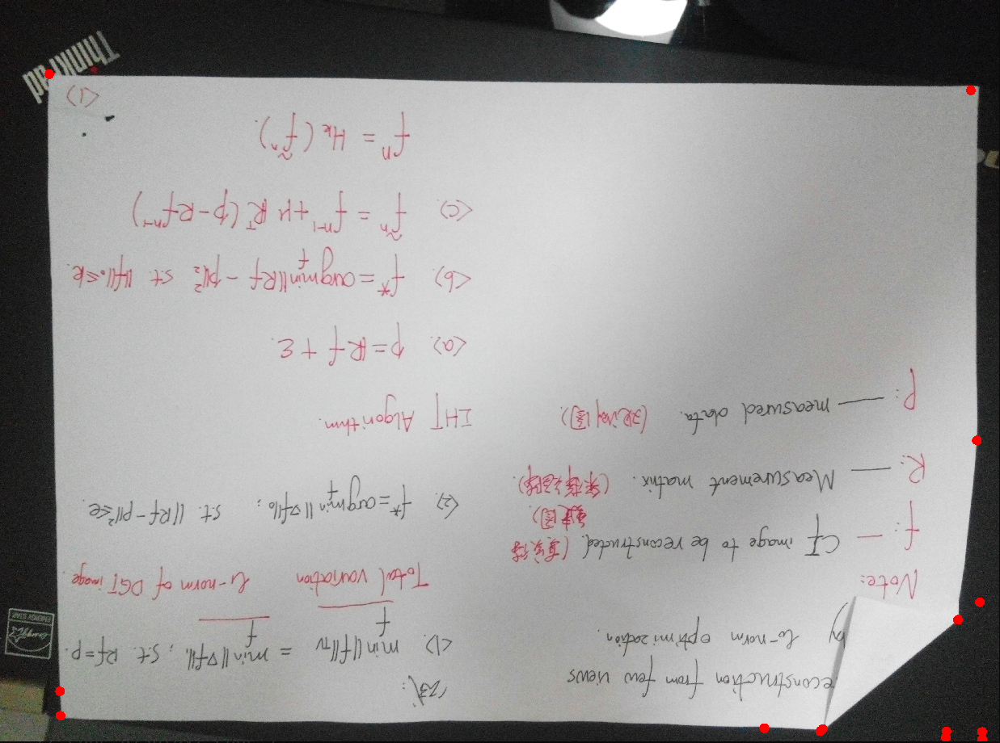
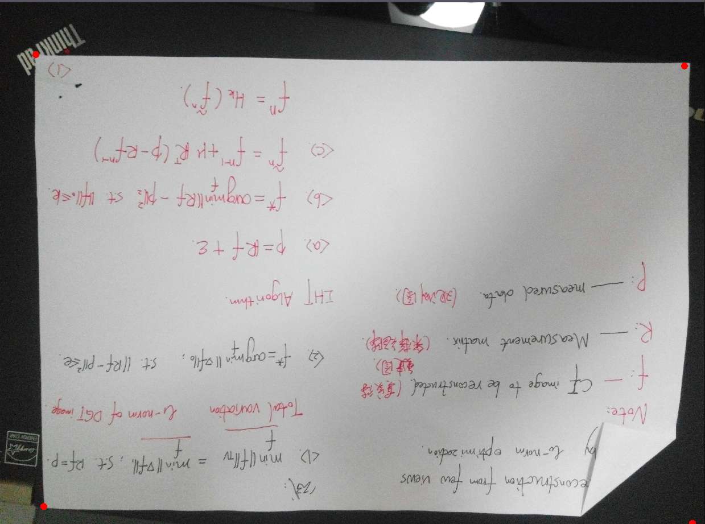

<h1 style="text-align: center;">《计算机视觉与模式识别》第五次作业</h1>

<h4 style="text-align: right;">chenhch8</h4>

### 环境说明
1. 运行环境: Linux
2. 编译命令: `g++ main.cpp ‐O2 ‐L/usr/X11R6/lib ‐lm ‐lpthread ‐lX11`
3. 源代码目录: `code/`
4. 在源代码目录下运行上述编译命令,生成 a.out 可执行文件,然后运行该可执行文件
5. 生成的图片保存在`output/`文件夹下

### 实验说明 
1. 实验目的：对图片中的A4纸采取透视变换的处理，使之由一个一般四边形变成一个标准的矩形。
2. 实验步骤：
	1. 提取出A4纸的四个顶点，其过程如下：
		1. 获取原图像的灰度图像
		2. 使用`canny`算法提取灰度图像中物体的边缘
		3. 使用`hough`变换，获取A4纸的四个顶点
	2. 确定四个顶点映射后的四个目标点
	3. 根据四个顶点和对应的四个目标点，求解出**透视变换矩阵**
	4. 利用求解出的**透视变换矩阵**，求解出目标图

### 问题记录
1. 在进行灰度图像的获取时，由于在一些测试图片上，背景中存在一些干扰，`canny`算法提取出的边缘，除了A4边缘外，还会有其它的不必要的边缘。同时，我发现，背景色都是偏暗，而A4纸则是偏亮，所以委屈去除背景带来的影响，我在进行灰度提前时，设置了一个阈值——当灰度值高于该阈值时，才将像素值赋给目标图，否则就直接赋为0。这样处理后，提取出来的灰度图，就几乎只剩下A4纸本身了，背景几乎全成了黑色。<br />
效果对比如下图：
<center>
	<figure style="display: inline-block">
		
		<figcaption>没有阈值处理</figcaption>
	</figure>
	<figure style="display: inline-block">
		
		<figcaption>有阈值处理</figcaption>
	</figure>
</center>
2. 在提取A4纸四个顶点时，发现，由于A4纸上的字、线条的影响，总会提取出多余的顶点。为了解决这个问题，我先对灰度图进行**膨胀处理**，该处理的目的是将A4纸上字、线条尽可能的“细化”甚至“抹去”，然后再进行**高斯模糊**，这样处理后，就能够减低A4纸上的字和线条所带来的影响。CImg库自带了膨胀处理函数`image.dilate(a)`，参数a是膨胀时卷积的大小，image是要膨胀出理的图像。此处我采用a=3来进行处理。<br />
效果对比如下图：
<center>
	<figure style="display: inline-block">
		
		<figcaption>没有膨胀处理</figcaption>
	</figure>
	<figure style="display: inline-block">
		
		<figcaption>有膨胀处理</figcaption>
	</figure>
</center>
3. 在提取顶点时，发现对于一些测试图片，会提取多于四个顶点，如下面1所示：
<center>
	<figure style="display: inline-block">
		
		<figcaption>Figure 1</figcaption>
	</figure>
	<figure style="display: inline-block">
		
		<figcaption>Figure 2</figcaption>
	</figure>
</center>
它的右下角，由于折角的关系，会提出多余的顶点。所以这时会提取打多余的顶点。此时就需要一个方法，来过滤出一些其它不必要的点，如上面的图2，就是我采用方法后过滤的最终效果——只剩下四个顶点了。下面说说我的做法：<br />
若发现提取出点的数量多余四个，则:
	1. 找出相距最远的两个点 $a$ 和 $b$ ，它们之间构成一条直线
	2. 分别在直线的两侧，找到点 $c$ 和 $d$，他们满足到该直线的距离最大。利用距离公式：$dis=\frac{|Ax_0+By_0+C|}{\sqrt{A^2+B^2}}$求解距离


对应的核心代码如下：
```c++
// 找出相距离最远的两个点
int m, n;
double distance, maxDistance = 0;
for (int i = 0; i < temp.size(); ++i) {
    for (int j = i + i; j < temp.size(); ++j) {
        distance = pow(temp[i].x - temp[j].x, 2) + pow(temp[i].y - temp[j].y, 2);
        if (distance > maxDistance) {
            maxDistance = distance;
            m = i; n = j;
        }
    }
}
// [2] 从所有交点中找出四个顶点
vector<Point> points;
if (temp.size() <= 4) {
    points.push_back(temp[m]);
    points.push_back(temp[n]);
    for (int i = 0; i < temp.size(); ++i) {
        if (i == m || i == n) continue;
        points.push_back(temp[i]);
    }
} else {
    // 找出斜线两边最远的两个点
    int a = 0, b = 0;
    bool isVertical = false; // 标识最远两点是否垂直
    double a_dis = 0, b_dis = 0;
    double xielu ,jieju, fenmu;
    if (temp[m].x - temp[n].x == 0) { // 垂直
        isVertical = true;
    } else { // 非垂直
        xielu = (temp[m].y - temp[n].y) / double(temp[m].x - temp[n].x);
        jieju = temp[m].y - xielu * temp[m].x;
        fenmu = sqrt(pow(xielu, 2) + 1);
    }
    double xxx;
    for (int i = 0; i < temp.size(); ++i) {
        if (i == m || i == n) continue;
        if (!isVertical) { // 斜线不垂直
            xxx = xielu * temp[i].x + jieju - temp[i].y;
            // 距离公式求解距离
            distance = fabs(xxx) / fenmu;
            if (xxx > 0 && distance > a_dis) { // 在直线的上方
                a_dis = distance;
                a = i;
            } else if (xxx < 0 && distance > b_dis) { // 在直线的下方
                b_dis = distance;
                b = i;
            }
        } else { // 斜线垂直
        	// 距离公式求解距离
            distance = temp[i].x - temp[m].x;
            if (distance > 0 && fabs(distance) > a_dis) {
                a_dis = fabs(distance);
                a = i;
            } else if (distance < 0 && fabs(distance) > b_dis) {
                b_dis = fabs(distance);
                b = i;
            }
        }
    }
    // 存入找到的四个顶点
    points.push_back(temp[m]);
    points.push_back(temp[n]);
    points.push_back(temp[a]);
    points.push_back(temp[b]);
}
```
4. 为了防止最终的矫正图出现上下/左右颠倒时，我们需要为所提取的四个顶点确定他们各自的位置。在标识四个顶点哪个位于左上、右上、右下、左下的位置时，我采用的方法如下：
	1. 找到y轴上最小的两个点 $a$ 和 $b$，它们之间必定有一个位于左上，一个位于右上;
	2. 从 $a$ 和 $b$ 中找出x轴上最小的那个，假设为 $a$, 那么就能确定 $a$ 是位于左上，$b$ 是位于右上的。那么他们的对角点的位置也就能确定了。

核心代码如下：
```c++
// [3] 对这四个顶点进行位置确定（及左上-0、右下-1、右上-2、左下-3）
int pt[2], ptr;
// [3.1] y轴上最小的点
ptr = 0;
for (int j = 0; j < points.size(); ++j) {
    if (points[ptr].y > points[j].y)
        ptr = j;
}
pt[0] = ptr;
// [3.2] y轴上次小的点
ptr = (++ptr) % points.size();
for (int j = 0; j < points.size(); ++j) {
    if (j != pt[0] && points[ptr].y > points[j].y)
        ptr = j;
}
pt[1] = ptr;
// [3.3] 找出左上点
if (points[pt[0]].x < points[pt[1]].x) {
    ptr = 0;
} else {
    ptr = 1;
}
// [3.4] 将points中的点按照 左上 右下 右上 左下 顺序存放
for (int i = 0; i < 2; ++i) {
    _points.push_back(points[pt[ptr]]);
    if (pt[ptr] % 2) {
        _points.push_back(points[pt[ptr] - 1]); 
    } else {
        _points.push_back(points[pt[ptr] + 1]);
    }
    ptr = ++ptr % 2;
}
```

### 实验结果图展示
<center>
	<figure style="display: inline-block">
		
		<figcaption>顶点标志图</figcaption>
	</figure>
	<figure style="display: inline-block">
		
		<figcaption>矫正结果图</figcaption>
	</figure>
</center>

<center>
	<figure style="display: inline-block">
		
		<figcaption>顶点标志图</figcaption>
	</figure>
	<figure style="display: inline-block">
		
		<figcaption>矫正结果图</figcaption>
	</figure>
</center>

<center>
	<figure style="display: inline-block">
		
		<figcaption>顶点标志图</figcaption>
	</figure>
	<figure style="display: inline-block">
		
		<figcaption>矫正结果图</figcaption>
	</figure>
</center>

<center>
	<figure style="display: inline-block">
		
		<figcaption>顶点标志图</figcaption>
	</figure>
	<figure style="display: inline-block">
		
		<figcaption>矫正结果图</figcaption>
	</figure>
</center>

<center>
	<figure style="display: inline-block">
		
		<figcaption>顶点标志图</figcaption>
	</figure>
	<figure style="display: inline-block">
		
		<figcaption>矫正结果图</figcaption>
	</figure>
</center>

<center>
	<figure style="display: inline-block">
		
		<figcaption>顶点标志图</figcaption>
	</figure>
	<figure style="display: inline-block">
		
		<figcaption>矫正结果图</figcaption>
	</figure>
</center>

<center>
	<figure style="display: inline-block">
		
		<figcaption>顶点标志图</figcaption>
	</figure>
	<figure style="display: inline-block">
		
		<figcaption>矫正结果图</figcaption>
	</figure>
</center>

<center>
	<figure style="display: inline-block">
		
		<figcaption>顶点标志图</figcaption>
	</figure>
	<figure style="display: inline-block">
		
		<figcaption>矫正结果图</figcaption>
	</figure>
</center>

<center>
	<figure style="display: inline-block">
		
		<figcaption>顶点标志图</figcaption>
	</figure>
	<figure style="display: inline-block">
		
		<figcaption>矫正结果图</figcaption>
	</figure>
</center>

<center>
	<figure style="display: inline-block">
		
		<figcaption>顶点标志图</figcaption>
	</figure>
	<figure style="display: inline-block">
		
		<figcaption>矫正结果图</figcaption>
	</figure>
</center>

<center>
	<figure style="display: inline-block">
		
		<figcaption>顶点标志图</figcaption>
	</figure>
	<figure style="display: inline-block">
		
		<figcaption>矫正结果图</figcaption>
	</figure>
</center>

### 实验分析
1. 我是通过透视变换矩阵，采用反向仿射的方式，根据目标位置找到原图对应的位置，但在找到后，我是直接用最近邻插入法来找到对应的像素值，而不是其他插值法，所以效果可能会不太好。在实际中可采用双线性插值法来改善效果。